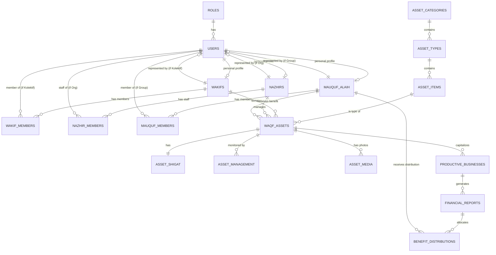

# Entity Relationship Diagram (ERD) - Wakaf Management System

This document outlines the database schema for the Nazhir/Wakaf system, covering both **Wakaf Penggunaan** (Use-based) and **Wakaf Produktif** (Productive).

## Role-Based Access Control (RBAC)

| Role | Access Level | Description |
| :--- | :--- | :--- |
| **Admin** | Full Access | Manage all users, roles, system configurations, and auditing. |
| **Nazhir** | Management | Manage assets, update conditions, file reports, and track distributions. |
| **Wakif** | View-Only / Reporting | Track their donated assets, view impact reports, and transaction history. |
| **Mauquf 'alaih** | Restricted View | View assets they are benefiting from and potentially request maintenance. |

## Entity Relationship Diagram (Mermaid)

## Recommended Tables (PostgreSQL)

### 1. User & Access Management

#### `roles`
- `id`: UUID (PK)
- `name`: VARCHAR(50) -- admin, nazhir, wakif, mauquf_alaih

#### `users`
- `id`: UUID (PK)
- `email`: VARCHAR(255) (Unique)
- `password`: VARCHAR(255)
- `role_id`: UUID (FK to roles)

### 2. Stakeholder Profiles (Pattern: Individual & Collective)

Semua stakeholder (Wakif, Nazhir, Mauquf Alaih) menggunakan pola yang sama untuk mendukung entitas **Perorangan** maupun **Kelompok/Lembaga**.

#### `wakifs`
- `id`: UUID (PK)
- `name`: VARCHAR(255) -- Nama individu atau Kelompok (e.g., Pejuang Dermawan)
- `wakif_type`: ENUM('personal', 'collective')
- `representative_id`: UUID (FK to users) -- PIC/Wakil utama.
#### `wakif_members`
- `id`: UUID (PK)
- `wakif_id`: UUID (FK to wakifs)
- `user_id`: UUID (FK to users)

#### `nazhirs`
- `id`: UUID (PK)
- `name`: VARCHAR(255) -- Nama individu atau Lembaga (e.g., Bilistiwa Pusat)
- `nazhir_type`: ENUM('individual', 'organization')
- `representative_id`: UUID (FK to users) -- Penanggung Jawab utama.
- `location_code`: VARCHAR(50) 
- `work_area`: VARCHAR(100) -- e.g., PUSAT
#### `nazhir_members`
- `id`: UUID (PK)
- `nazhir_id`: UUID (FK to nazhirs)
- `user_id`: UUID (FK to users) -- Staf atau pengurus di dalam lembaga nazhir.

#### `mauquf_alaih`
- `id`: UUID (PK)
- `name`: VARCHAR(255) -- Nama individu atau Institusi (e.g., Madrasah Al-Fatih)
- `mauquf_type`: ENUM('individual', 'group_institution')
- `representative_id`: UUID (FK to users) -- Delegasi penerima manfaat.
- `description`: TEXT
#### `mauquf_members`
- `id`: UUID (PK)
- `mauquf_alaih_id`: UUID (FK to mauquf_alaih)
- `user_id`: UUID (FK to users) -- Anggota kelompok (e.g., murid di madrasah).

### 3. Asset Classification (Hierarchical)

#### `asset_categories`
- `id`: UUID (PK)
- `name`: VARCHAR(100) -- e.g., Harta Bergerak
- `code`: VARCHAR(10) -- e.g., 02.

#### `asset_types`
- `id`: UUID (PK)
- `category_id`: UUID (FK)
- `name`: VARCHAR(100) -- e.g., Kendaraan
- `code`: VARCHAR(10) -- e.g., 01.

#### `asset_items`
- `id`: UUID (PK)
- `type_id`: UUID (FK)
- `name`: VARCHAR(100) -- e.g., Motor
- `code`: VARCHAR(10) -- e.g., 02.

### 4. Core Asset Table (`waqf_assets`)

| Column | Type | Description |
| :--- | :--- | :--- |
| `id` | UUID (PK) | Unique identifier |
| `item_id` | UUID (FK) | Link to asset_items |
| `wakif_id` | UUID (FK) | Link to wakifs |
| `nazhir_id` | UUID (FK) | Link to nazhirs |
| `mauquf_id` | UUID (FK) | Link to mauquf_alaih |
| `asset_name` | VARCHAR | Name/Brand (e.g., Kawasaki KLX 150) |
| `plate_number` | VARCHAR | For vehicles (e.g., B 3674 ESS) |
| `color` | VARCHAR | Asset color |
| `unit_count` | INT | Quantity |
| `unit_measure`| VARCHAR | Unit, m2, etc. |
| `waqf_date` | DATE | Tanggal Diwakafkan |
| `semester` | VARCHAR | Semester |
| `year` | VARCHAR | Tahun |
| `duration_type`| VARCHAR | Abadi vs Berjangka |
| `waqf_type` | VARCHAR | **Penggunaan** vs **Produktif** |
| `usage_category`| VARCHAR | e.g., Wakaf Pemakaian |
| `management_status`| VARCHAR | Status Pengelolaan |
| `estimated_value`| NUMERIC | Nilai Estimasi |
| `barcode_code` | VARCHAR | Barcode |
| `inventory_code`| VARCHAR | Kode Inventaris |
| `is_complete` | BOOLEAN | Kelengkapan data |

### 5. Shigat & Management

#### `asset_shigat`
- `id`: UUID (PK)
- `asset_id`: UUID (FK)
- `lafadz_text`: TEXT -- Shigat (Lafadz Akad Wakaf)
- `intended_use`: TEXT -- Tujuan Utama
- `document_url`: VARCHAR -- Link ke Sertifikat / BPKB

#### `asset_management`
- `id`: UUID (PK)
- `asset_id`: UUID (FK)
- `pic_name`: VARCHAR -- Penanggung Jawab Fisik
- `pic_contact`: VARCHAR -- Kontak PIC
- `condition`: VARCHAR -- Kondisi
- `maintenance_status`: VARCHAR -- Pemeliharaan

#### `asset_media`
- `id`: UUID (PK)
- `asset_id`: UUID (FK)
- `media_type`: VARCHAR -- 'initial' vs 'current'
- `file_url`: VARCHAR
- `captured_at`: TIMESTAMP

---

## 6. Detail Wakaf Produktif (Productive Waqf)

### `productive_businesses` (Usaha_Produktif)
- `id`: UUID (PK)
- `asset_id`: UUID (FK) -- Aset modal.
- `business_name`: VARCHAR(255)
- `business_type`: VARCHAR(100) -- e.g., Pertanian, Retail.
- `status`: ENUM('active', 'inactive')
- `manager_name`: VARCHAR(255)
- `start_date`: DATE

### `financial_reports` (Laporan_Keuangan_Berkala)
- `id`: UUID (PK)
- `business_id`: UUID (FK)
- `report_period`: VARCHAR(50) -- e.g., "Januari 2024".
- `total_revenue`: NUMERIC
- `total_expense`: NUMERIC
- `net_profit`: NUMERIC
- `report_date`: DATE
- `document_url`: VARCHAR

### `benefit_distributions` (Distribusi_Manfaat)
- `id`: UUID (PK)
- `report_id`: UUID (FK)
- `mauquf_alaih_id`: UUID (FK)
- `amount`: NUMERIC
- `distribution_date`: DATE
- `notes`: TEXT

---

## Struktur Hubungan (Relationship Summary)

1.  **Stakeholder Groups**: Semua stakeholder (Wakif, Nazhir, Mauquf) memiliki relasi ke `users` melalui `representative_id` (sebagai PIC) dan tabel `members` (sebagai jajaran anggota/staf).
2.  **Asset utilization**: `waqf_assets` menghubungkan ketiga stakeholder (Wakif -> Asset -> Nazhir -> Mauquf).
3.  **Productive flow**: Asset menumbuhkan Bisnis, Bisnis menghasilkan Laporan Laba, Laporan Laba mendasari Distribusi ke Mauquf Alaih.
