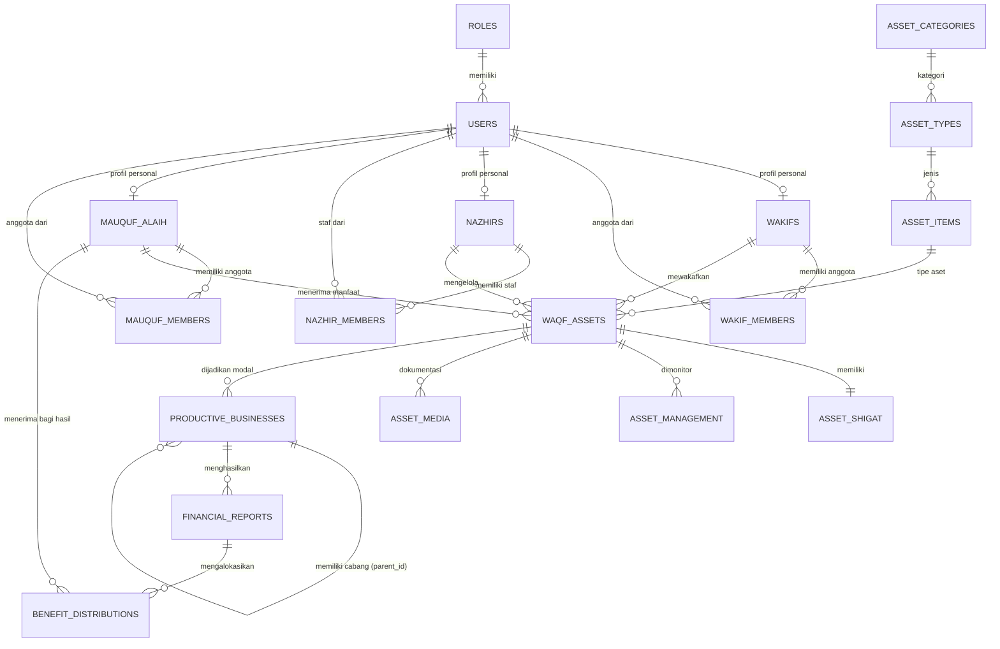

# Entity Relationship Diagram (ERD) - Sistem Manajemen Wakaf

Dokumen ini menjelaskan struktur database untuk sistem pengelolaan Wakaf, mencakup **Wakaf Pemakaian** dan **Wakaf Produktif** dengan desain simetris dan terstandarisasi.

## Pillar Utama Wakaf (Symmetrical Pillars)
Sistem ini dibangun di atas 5 pilar utama yang berlaku baik untuk jenis Pemakaian maupun Produktif:
1. **Nazhir** (Pengelola)
2. **Wakif** (Pemberi)
3. **Mauquf** (Harta/Asset)
4. **Mauquf Alaih** (Penerima Manfaat)
5. **Shigat** (Akad/Janji)

## Entity Relationship Diagram (Mermaid)

## Rekomendasi Tabel (PostgreSQL)

### 1. Manajemen User & Akses

#### `roles`
- `id`: INT (PK Auto-increment)
- `name`: VARCHAR(50) -- admin, nazhir, wakif, mauquf_alaih

#### `users`
- `id`: INT (PK Auto-increment)
- `email`: VARCHAR(255) (Unique)
- `password`: VARCHAR(255)
- `role_id`: INT (FK to roles)

### 2. Stakeholder (Perorangan & Kelompok)

Pola simetris untuk Wakif, Nazhir, dan Mauquf Alaih.

#### `wakifs`
- `id`: INT (PK Auto-increment)
- `name`: VARCHAR(255) (Nama Personal/Kelompok)
- `wakif_type`: ENUM('personal', 'collective')
- `representative_id`: INT (FK to users) -- PIC/Wakil
#### `wakif_members`
- `id`: INT (PK)
- `wakif_id`: INT (FK)
- `user_id`: INT (FK)

#### `nazhirs`
- `id`: INT (PK Auto-increment)
- `name`: VARCHAR(255) (Nama Personal/Lembaga)
- `nazhir_type`: ENUM('individual', 'organization')
- `representative_id`: INT (FK to users) -- Penanggung Jawab
- `location_code`: VARCHAR(50) 
- `work_area`: VARCHAR(100)
#### `nazhir_members`
- `id`: INT (PK)
- `nazhir_id`: INT (FK)
- `user_id`: INT (FK)

#### `mauquf_alaih`
- `id`: INT (PK Auto-increment)
- `name`: VARCHAR(255)
- `mauquf_type`: ENUM('individual', 'group_institution')
- `representative_id`: INT (FK to users)
- `description`: TEXT
#### `mauquf_members`
- `id`: INT (PK)
- `mauquf_alaih_id`: INT (FK)
- `user_id`: INT (FK)

### 3. Klasifikasi Aset (Hierarki Spreadsheet)

#### `asset_categories`, `asset_types`, `asset_items`
- Semua `id`: INT (PK Auto-increment)
- Relasi FK menggunakan INT.

### 4. Tabel Inti Aset Wakaf (`waqf_assets`)
Tabel utama untuk jenis **Pemakaian** dan **Produktif**.

| Column | Type | Description |
| :--- | :--- | :--- |
| `id` | INT (PK) | Auto-increment |
| `item_id` | INT (FK) | Link ke jenis aset |
| `wakif_id` | INT (FK) | Link ke pemberi |
| `nazhir_id` | INT (FK) | Link ke pengelola |
| `mauquf_id` | INT (FK) | Link ke penerima manfaat |
| `asset_name` | VARCHAR | Nama Merk/Barang |
| `plate_number` | VARCHAR | Nomor Plat (jika kendaraan) |
| `color` | VARCHAR | Warna |
| `unit_count` | INT | Jumlah |
| `waqf_type` | VARCHAR | **Pemakaian** atau **Produktif** |
| `estimated_value`| NUMERIC | Nilai Estimasi |
| `is_complete` | BOOLEAN | Kelengkapan data (Spreadsheet status) |

### 5. Shigat & Manajemen

#### `asset_shigat`
- `id`: INT (PK)
- `asset_id`: INT (FK)
- `lafadz_text`: TEXT -- Isi Akad
- `document_url`: VARCHAR -- Scan Sertifikat/Dokumen

#### `asset_management`
- `id`: INT (PK)
- `asset_id`: INT (FK)
- `pic_name`: VARCHAR (Penanggung Jawab Fisik)
- `current_condition`: VARCHAR (Kondisi Saat Ini)

#### `asset_media`
- `id`: INT (PK)
- `asset_id`: INT (FK)
- `file_url`: VARCHAR
- `media_type`: VARCHAR (Awal/Update Berkala)

---

## 6. Pengembangan Wakaf Produktif & Cabang (Hierarchy)

Jika aset dikelola menjadi unit usaha, tabel berikut digunakan.

### `productive_businesses` (Unit Usaha)
Unit usaha dapat memiliki jenjang (Pusat & Cabang).
- `id`: INT (PK Auto-increment)
- `parent_id`: INT (FK to self, Nullable) -- **Hierarki Cabang**. Jika Null = Pusat.
- `asset_id`: INT (FK to waqf_assets) -- Aset modal.
- `business_name`: VARCHAR(255)
- `location`: VARCHAR(255) -- Lokasi Spesifik Cabang.
- `status`: ENUM('active', 'inactive')

### `financial_reports` (Laporan Keuangan)
Laporan per cabang atau per unit usaha.
- `id`: INT (PK Auto-increment)
- `business_id`: INT (FK)
- `report_period`: VARCHAR(50)
- `net_profit`: NUMERIC -- Laba Bersih yang siap dibagikan.

### `benefit_distributions` (Penyaluran Manfaat)
Tabel ini memetakan hasil usaha produktif kembali ke Mauquf Alaih.
- `id`: INT (PK Auto-increment)
- `report_id`: INT (FK)
- `mauquf_alaih_id`: INT (FK) -- Penerima sesuai pilar inti.
- `amount`: NUMERIC
- `distribution_date`: DATE
