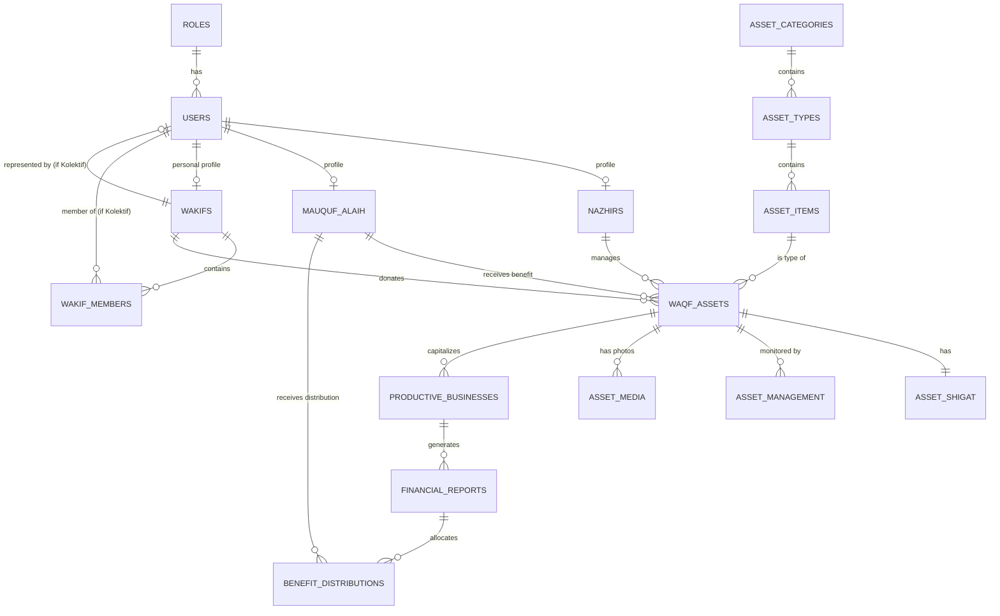

# Entity Relationship Diagram (ERD) - Wakaf Management System

This document outlines the database schema for the Nazhir/Wakaf system, covering both **Wakaf Penggunaan** (Use-based) and **Wakaf Produktif** (Productive).

## Role-Based Access Control (RBAC)

| Role | Access Level | Description |
| :--- | :--- | :--- |
| **Admin** | Full Access | Manage all users, roles, system configurations, and auditing. |
| **Nazhir** | Management | Manage assets, update conditions, file reports, and track distributions. |
| **Wakif** | View-Only / Reporting | Track their donated assets, view impact reports, and transaction history. |
| **Mauquf 'alaih** | Restricted View | View assets they are benefiting from and potentially request maintenance. |

## Entity Relationship Diagram (Mermaid)

## Recommended Tables (PostgreSQL)

### 1. User & Access Management

#### `roles`
Stores the system roles.
- `id`: UUID (PK)
- `name`: VARCHAR(50) -- admin, nazhir, wakif, mauquf_alaih

#### `users`
Core user table.
- `id`: UUID (PK)
- `email`: VARCHAR(255) (Unique)
- `password`: VARCHAR(255)
- `role_id`: UUID (FK to roles)

### 2. Stakeholder Profiles (Wakif Personal & Kolektif)

#### `wakifs`
Tabel profil untuk donatur. Tabel ini menghandle kondisi **Personal** dan **Kolektif**.

| Column | Type | Description |
| :--- | :--- | :--- |
| `id` | UUID (PK) | Unique identifier |
| `name` | VARCHAR(255) | Nama individu (Personal) atau Nama Kelompok (Kolektif) |
| `wakif_type` | ENUM | **'personal'** atau **'collective'** |
| `representative_id`| UUID (FK) | Relasi ke `users`. Jika 'kolektif', maka ini adalah PIC kelompok |
| `created_at` | TIMESTAMP | Waktu pendaftaran |

#### `wakif_members` (New)
Tabel opsional untuk melacak individu anggota dalam sebuah kelompok (Kolektif).
- `id`: UUID (PK)
- `wakif_id`: UUID (FK to wakifs) -- Relasi ke entity kolektif.
- `user_id`: UUID (FK to users) -- Relasi ke individu yang menjadi anggota.
- `role_in_group`: VARCHAR(100) -- e.g., Ketua, Anggota, Bendahara.

#### `nazhirs`
Profile for the manager.
- `id`: UUID (PK)
- `user_id`: UUID (FK to users)
- `name`: VARCHAR(255)
- `location_code`: VARCHAR(50) -- e.g., 00.
- `work_area`: VARCHAR(100) -- e.g., PUSAT

#### `mauquf_alaih`
Profile for the beneficiaries.
- `id`: UUID (PK)
- `user_id`: UUID (FK to users, Nullable)
- `name`: VARCHAR(255)
- `description`: TEXT

### 3. Asset Classification (Hierarchical)

#### `asset_categories`
- `id`: UUID (PK)
- `name`: VARCHAR(100) -- e.g., Harta Bergerak
- `code`: VARCHAR(10) -- e.g., 02.

#### `asset_types`
- `id`: UUID (PK)
- `category_id`: UUID (FK)
- `name`: VARCHAR(100) -- e.g., Kendaraan
- `code`: VARCHAR(10) -- e.g., 01.

#### `asset_items`
- `id`: UUID (PK)
- `type_id`: UUID (FK)
- `name`: VARCHAR(100) -- e.g., Motor
- `code`: VARCHAR(10) -- e.g., 02.

### 4. Core Asset Table (`waqf_assets`)

This table consolidates the spreadsheet data.

| Column | Type | Description |
| :--- | :--- | :--- |
| `id` | UUID (PK) | Unique identifier |
| `item_id` | UUID (FK) | Link to asset_items |
| `wakif_id` | UUID (FK) | Link to wakifs |
| `nazhir_id` | UUID (FK) | Link to nazhirs |
| `mauquf_id` | UUID (FK) | Link to mauquf_alaih |
| `asset_name` | VARCHAR | Name/Brand (e.g., Kawasaki KLX 150) |
| `plate_number` | VARCHAR | For vehicles (e.g., B 3674 ESS) |
| `color` | VARCHAR | Asset color |
| `unit_count` | INT | Quantity |
| `unit_measure`| VARCHAR | e.g., Unit, m2, etc. |
| `waqf_date` | DATE | Tanggal Diwakafkan |
| `semester` | VARCHAR | e.g., /02 |
| `year` | VARCHAR | e.g., /21 |
| `duration_type`| VARCHAR | Abadi (Selamanya) or Berjangka |
| `waqf_type` | VARCHAR | **Penggunaan** or **Produktif** |
| `usage_category`| VARCHAR | e.g., Wakaf Pemakaian |
| `management_status`| VARCHAR | e.g., Digunakan untuk Program Sosial |
| `estimated_value`| NUMERIC | Current estimation value |
| `barcode_code` | VARCHAR | e.g., 001/02/21 |
| `inventory_code`| VARCHAR | e.g., 00.02.01.02.001/02/21 |
| `is_complete` | BOOLEAN | Data completeness status |

### 5. Shigat & Management

#### `asset_shigat`
- `id`: UUID (PK)
- `asset_id`: UUID (FK)
- `lafadz_text`: TEXT -- Shigat (Lafadz Akad Wakaf)
- `intended_use`: TEXT -- Aset Wakaf Ditujukan Untuk (Sesuai Shigat)
- `document_url`: VARCHAR -- Link to Certificate/BPKB/STNK

#### `asset_management`
- `id`: UUID (PK)
- `asset_id`: UUID (FK)
- `pic_name`: VARCHAR -- Penanggung Jawab
- `pic_contact`: VARCHAR -- Kontak PIC
- `condition`: VARCHAR -- Kondisi (Masih Berfungsi)
- `maintenance_status`: VARCHAR -- Pemeliharaan (Jarang Dirawat)

#### `asset_media`
- `id`: UUID (PK)
- `asset_id`: UUID (FK)
- `media_type`: VARCHAR -- 'initial' (at donation) or 'current' (update)
- `file_url`: VARCHAR
- `captured_at`: TIMESTAMP

---

## 6. Detail Wakaf Produktif (Productive Waqf)

Bagian ini menjelaskan alur ekonomi dari aset wakaf yang dikelola menjadi usaha produktif.

### `productive_businesses` (Usaha_Produktif)
Menyimpan data unit usaha yang menggunakan modal/aset wakaf.
- `id`: UUID (PK)
- `asset_id`: UUID (FK to waqf_assets) -- Aset yang dijadikan modal.
- `business_name`: VARCHAR(255) -- Nama unit usaha.
- `business_type`: VARCHAR(100) -- e.g., Pertanian, Retail, Properti.
- `status`: ENUM('active', 'inactive', 'closed')
- `manager_name`: VARCHAR(255) -- Penanggung jawab operasional usaha.
- `start_date`: DATE

### `financial_reports` (Laporan_Keuangan_Berkala)
Laporan performa keuangan dari unit usaha produktif.
- `id`: UUID (PK)
- `business_id`: UUID (FK to productive_businesses)
- `report_period`: VARCHAR(50) -- e.g., "Januari 2024", "Q1 2024".
- `total_revenue`: NUMERIC -- Total Pendapatan.
- `total_expense`: NUMERIC -- Total Biaya Operasional.
- `net_profit`: NUMERIC -- Laba Bersih (Surplus Wakaf).
- `report_date`: DATE
- `document_url`: VARCHAR -- Link ke file laporan detail (PDF).

### `benefit_distributions` (Distribusi_Manfaat)
Penyaluran surplus wakaf kepada penerima manfaat (Mauquf Alaih).
- `id`: UUID (PK)
- `report_id`: UUID (FK to financial_reports) -- Dasar distribusi.
- `mauquf_alaih_id`: UUID (FK to mauquf_alaih) -- Penerima.
- `amount`: NUMERIC -- Jumlah yang disalurkan.
- `distribution_date`: DATE
- `distribution_method`: VARCHAR -- e.g., Transfer, Tunai, Barang.
- `notes`: TEXT

---

## Struktur Hubungan (Relationship Summary)

1.  **Aset ke Usaha**: Hubungan **1:N** (*Satu aset bisa digunakan untuk satu atau lebih unit usaha produktif*).
2.  **Usaha ke Laporan**: Hubungan **1:N** (*Satu unit usaha menghasilkan banyak laporan keuangan berkala*).
3.  **Laporan ke Distribusi**: Hubungan **1:N** (*Satu laporan laba dapat didistribusikan ke banyak Mauquf Alaih*).
4.  **Mauquf Alaih ke Distribusi**: Hubungan **1:N** (*Satu penerima manfaat dapat menerima banyak kali distribusi dari berbagai laporan/unit usaha*).
